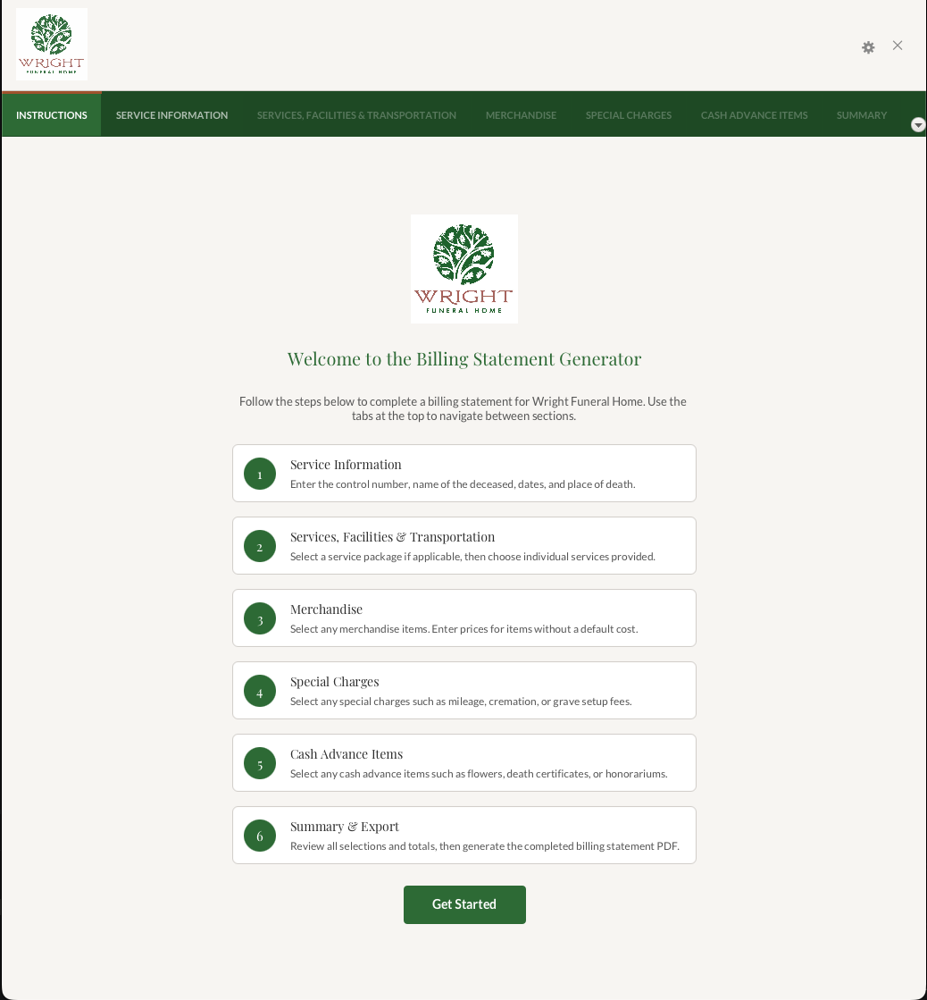
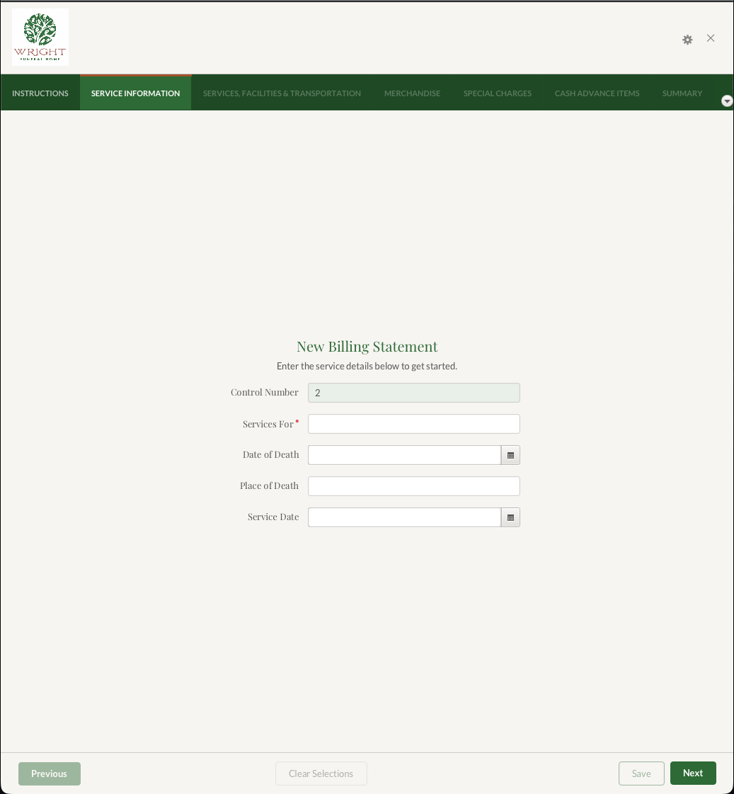
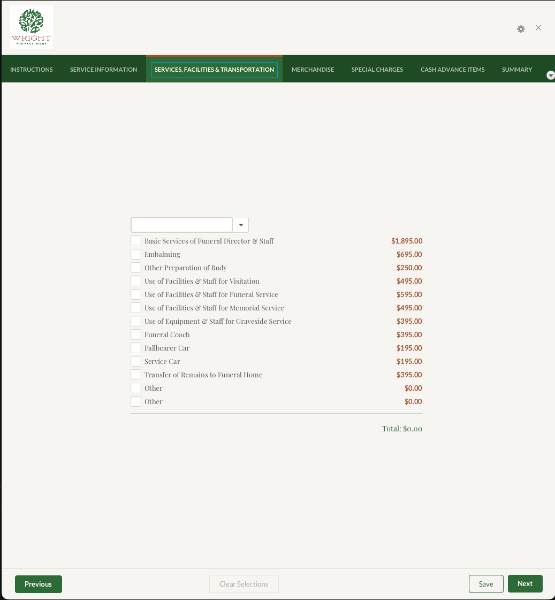
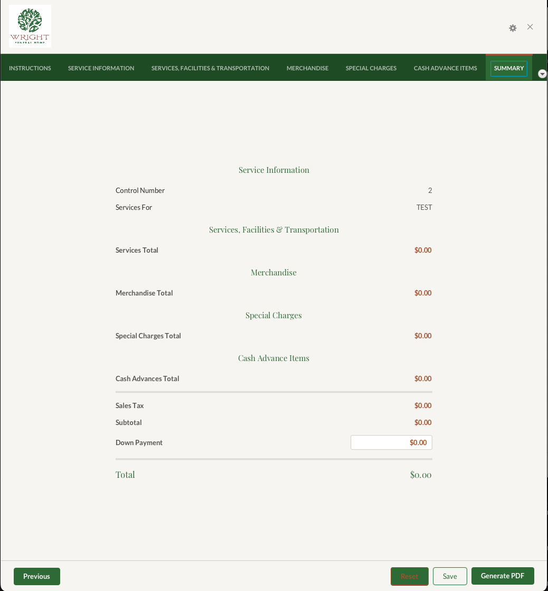
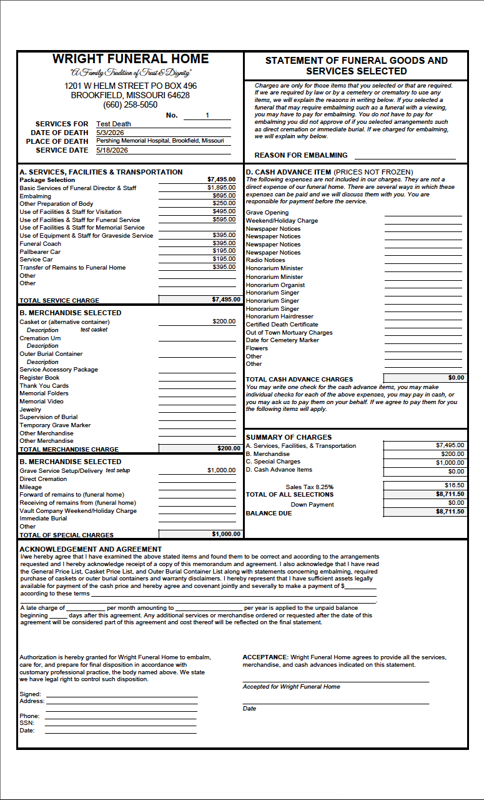

# Wright Funeral Home Billing Statement Generator

A desktop JavaFX application for generating funeral home billing statements. Users enter service information, select
packages, services, merchandise, special charges, and cash advances, then export a formatted PDF statement.

## Screenshots

| Instructions                                           | Service Information                                                  |
|--------------------------------------------------------|----------------------------------------------------------------------|
|  |  |

| Services                                       | Summary                                      |
|------------------------------------------------|----------------------------------------------|
|  |  |



> Place screenshots in `docs/screenshots/` and commit them to replace these placeholders.

## Stack

- Java 11, JavaFX 17
- Gradle (wrapper included)
- H2 in-memory database initialized from SQL scripts
- DynamicReports / iText for PDF generation
- Groovy / Spock for tests
- SLF4J + Logback for logging

## Requirements

- JDK 11 or higher
- Use the included Gradle wrapper (`./gradlew`) — do not rely on a globally installed Gradle version

## Quick start

```bash
git clone <repository-url>
cd wfh-billing-statement-generator
./gradlew run
```

If you see `UnsupportedClassVersionError`, your `JAVA_HOME` is pointing to a JDK older than 11. Override it for the
command:

```bash
JAVA_HOME=/path/to/jdk11 ./gradlew run
```

## Common commands

| Task               | Command           |
|--------------------|-------------------|
| Run the app        | `./gradlew run`   |
| Build              | `./gradlew build` |
| Run all tests      | `./gradlew test`  |
| Clean build output | `./gradlew clean` |

Run a single test class:

```bash
./gradlew test --tests "com.palmer.billingstatementgenerator.db.DatabaseSpec"
```

Run a single test method:

```bash
./gradlew test --tests "com.palmer.billingstatementgenerator.db.DatabaseSpec.someMethod"
```

## Project layout

```
src/
  main/
    java/       application code (dao, db, models, pdf, views)
    resources/  SQL scripts, FXML, PDF templates, images, CSS
  test/
    groovy/     Spock specifications
    java/       JUnit tests
build.gradle
gradlew
```

## UI architecture

The UI uses an FXML + controller pattern. Tabs are wired by `GeneratorTabs`, which merges FXML `GridPane` children where
an FXML file exists, wires the shared Previous / Next / Clear buttons, and calls controller lifecycle hooks (`onShow` /
`onHide`).

All tab controllers extend `BaseController`, which provides:

- `addCheckboxRowsWithPrices` / `addCheckboxRows` — stream-based row builders
- `extractCheckboxesFromGrid` — convenience method for reading checkbox state
- `configTextFieldForInts` / `bindIntegerTextField` — integer field helpers
- `onShow()` / `onHide()` lifecycle hooks

Description and provider fields automatically select their row's checkbox when non-empty.